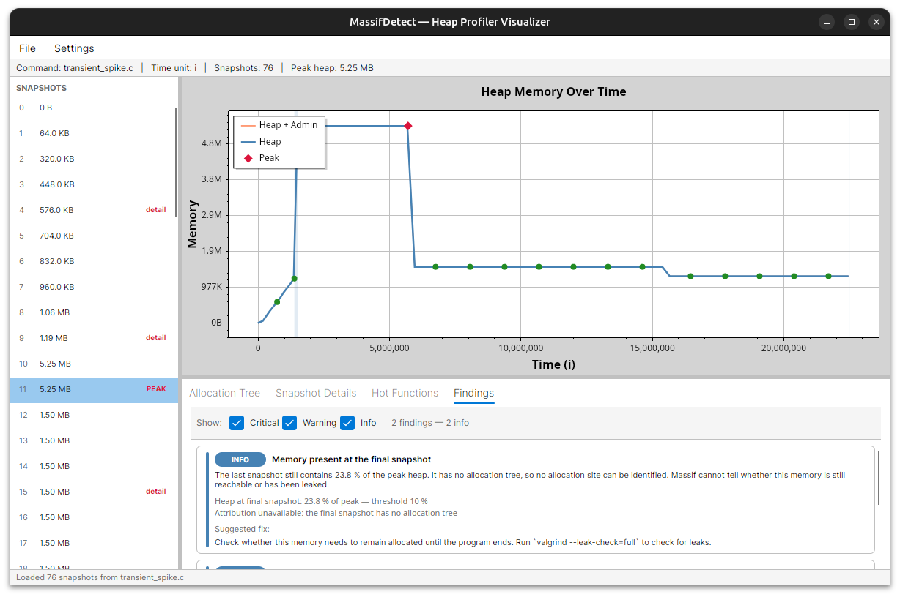

# MassifDetect

MassifDetect is a C# desktop app for viewing and analyzing Valgrind Massif heap
profiles. It uses Avalonia for the interface and ScottPlot for the memory chart.



## Requirements and setup

- .NET 10 SDK to build and run the app.
- GCC and Valgrind on your PATH to profile C source files. Use Linux for this workflow.
- GCC and Valgrind are not needed to open an existing Massif profile.

Run these commands from the repository root:

```sh
dotnet restore
dotnet build
dotnet run --project MassifVisualizer/MassifVisualizer.csproj
```

To start with one of the included profiles:

```sh
dotnet run --project MassifVisualizer/MassifVisualizer.csproj -- sample/massif.out.leak
```

## What you can do

- Open a `massif.out.*` file through **File > Open massif file**.
- Compile and profile a single C file through **File > Open source file**.
  The app runs GCC and Valgrind, then loads the result.
- View heap usage and allocator overhead over time.
- Browse snapshots, allocation trees, and snapshot details.
- View hot functions ranked by their largest recorded memory use.
- Filter findings by severity and jump to their evidence snapshots.
- View source locations when the profile was generated from a C file in the app.

The app includes four detection rules:

| Rule | What it looks for |
| --- | --- |
| LEAK | Heap growth with high memory retention at the end. |
| ATEXIT | A significant amount of memory in the last snapshot. |
| SPIKE | Sudden increases in heap usage and whether usage later drops. |
| FRAG | High estimated allocator overhead compared with the useful heap. |

Findings include supporting values and suggestions. They are clues, not proof of
a bug. Massif cannot confirm memory leaks; use Memcheck to investigate them.

**Settings** lets you change Massif options and detection thresholds. Settings last
only for the current session. Massif options apply to the next C profiling run.
Detection thresholds apply the next time a profile is loaded or generated;
existing findings are not recalculated when you press Apply.

## Examples

The [sample](sample/) folder contains six C programs and their profiles: normal
behavior, suspected leaks, memory left at the end, temporary and retained spikes,
and high allocator overhead.

The examples use executed instructions (`i`) for the time axis, not seconds.

To regenerate them with GCC and Valgrind:

```sh
./sample/generate.sh
```
